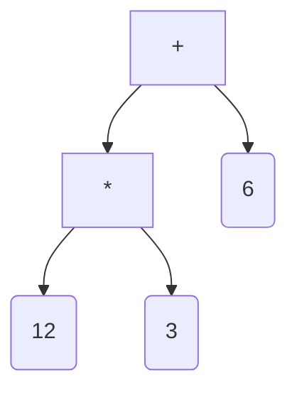

# Expression Tree Kata scaffolding, utilities, and solutions



This repo contains various resources for the exercise: [Evaluate calculator expressions](https://www.notion.so/weareacademy/Evaluate-calculator-expressions-8ca6e97836dc42ba949a6e8b261378d3).

If you want some scaffolding you can work from `src/task/expressions.ts` and use or re-write tests in `src/task/expressions-test.ts`

There are also some solutions in `src/solutions`

## Bonus: generating a diagram

A function has been provided which will take an expression tree and generate the necessary graphviz dot-language code to make a directed graph. Just paste the result into graphviz - e.g. at https://dreampuf.github.io/GraphvizOnline/

See `src/solutions/generateGraph.ts`

## Bonus: parsing from string to expression tree

For the curious, a simple parser has been provided which will create an expression tree from a string. See: `src/solutions/parser.test.ts`

You use it by calling `parseExpression(str)`

Example:

```typescript
parseExpression("(+ (/ 5 (* 2 5)) (- 5 4))");

//should yield

{
  op: "add",
  a: { op: "divide", a: 5, b: { op: "multiply", a: 2, b: 5 } },
  b: { op: "subtract", a: 5, b: 4 },
}
```
